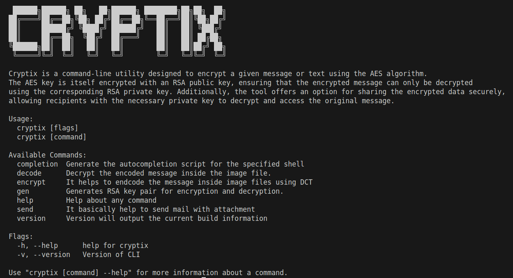
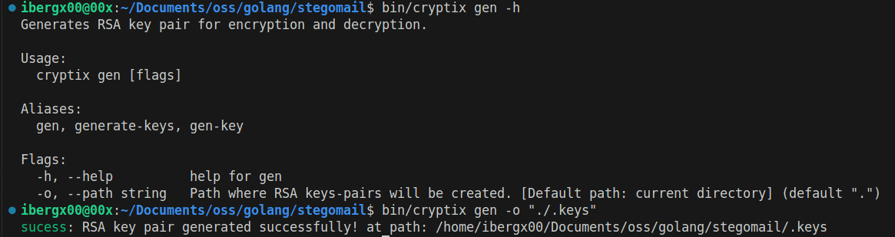
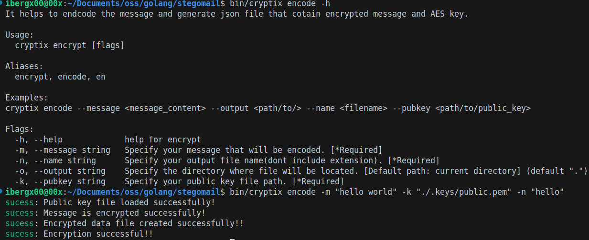
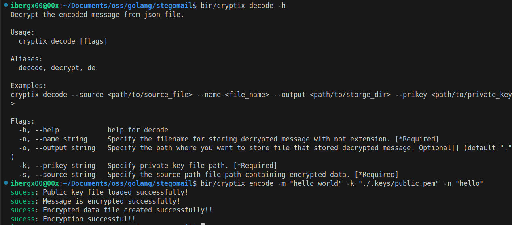
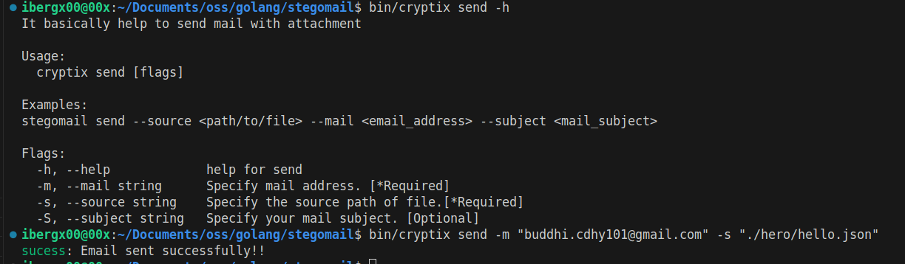

<p align="center">
  
</p>

**Cryptix** is a simple command-line utility that leverages advanced cryptographic algorithms to securely encrypt and decrypt messages. It combines the AES (Advanced Encryption Standard) algorithm for encrypting the content of the message with RSA for encrypting the AES encryption key. This ensures that only individuals with the corresponding RSA private key can decrypt the message.

---

### The main features of Cryptix are:

- **AES Encryption**: Encrypts the message using the AES algorithm.
- **RSA Encryption of AES Key and Decryption**: The AES key is encrypted using an RSA public key, ensuring that the encrypted message can only be decrypted using the corresponding RSA private key.
- **Sharing Option**: The tool includes an option for sharing the encrypted data securely, through Google Drive.
- **Download option**: Downloadable link is provided for receiver and reciver can decrypt the data through the RSA private key.

This project is built using Go and is designed to provide robust and secure encryption for sensitive information.

---

### Project: cryptix

This project, `cryptix`, is built using the Go programming language. Below is a list of the main technologies, libraries, and dependencies used in this project.

<p align="center">
  
</p>

### *Brief Command Screenshot*

> *generate-keys*

<p align="center">
  
</p>

> *encode*

<p align="center">
  
</p>

> *decrypt*

<p align="center">
  
</p>

> *send*

<p align="center">
  
</p>

---

### Technologies Used

The following technologies and libraries are used in the Cryptix project:

- **Go 1.23.4**: The programming language used to build the tool.

- **sirupsen/logrus v1.9.3**: A structured logger for Go, used for logging information and errors.
- **spf13/cobra v1.8.1**: A library for creating powerful CLI applications.

- **crypt v0.33.0**: A cryptography library for performing AES and RSA encryption and decryption operations, providing secure cryptographic functionality within the tool.

- **google.golang.org/api v0.220.0**: Google API client libraries for interacting with Google Cloud services.

- **cloud.google.com/go/auth v0.14.1**: Provides Google Cloud authentication methods.

- **gookit/color v1.5.4**: A package for adding color to the terminal output.

- **joho/godotenv v1.5.1**: A package for loading environment variables from `.env` files.

---

### setup

```env
#CLI Info
CLI_NAME=stegomail
CLI_VERSION=1.0.0-stable
CLI_BINARY_PATH=bin/stegomail

#SMTP 
FROM_EMAIL=
FROM_EMAIL_PASSWORD=
FROM_EMAIL_SMTP=smtp.gmail.com
SMTP_ADDR=smtp.gmail.com:587
SUBJECT_DESC=
HTML_TEMPLATE=""
OAUTH_CREDENTIALS_PATH=

#Format
TXT_FORMAT=.txt
JSON_FORMAT=.json

```

## Cryptix Makefile Documentation

This `Makefile` provides an easy interface to build, test, install, and clean the Cryptix project. It automates common tasks required for the development and deployment of the project.

## Variables

- **BINARY_NAME**: Specifies the name of the output binary file. In this case, it is set to `cryptix`.

- **OUTPUT_DIR**: Specifies the directory where the binary will be output. The default is `bin`.

- **MAIN_FILE**: Specifies the path to the main Go file. This is where the Go code for the project starts (default: `./main.go`).

- **INSTALL_DIR**: Specifies where the binary should be installed. By default, it installs to `$HOME/go/bin` if the `GOBIN` environment variable is not set.

## Targets

The Makefile has the following targets that automate the build process:

#### `build`

- **Description**: Builds the binary from the main Go file and outputs it to the `bin` directory.

- **Commands**:
    1. Creates the `bin` directory if it doesn't already exist.

    2. Runs the `go build` command to compile the Go project into a binary named `cryptix`.

    3. Outputs the path to the built binary.

- **Usage**: 

    ```bash
    make build
    ```

#### `test`

- **Description**: Runs the tests for the project using `go test`.

- **Commands**:

    1. Executes the `go test` command on the entire project (`./...`).

    2. Prints the results of the tests to the terminal.

- **Usage**: 

    ```bash
    make test
    ```

### `install`

- **Description**: Builds the project and installs the binary to the `GOBIN` directory.

- **Commands**:

    1. Runs the `build` target to compile the binary.

    2. Installs the binary to the directory specified by `GOBIN`.

- **Usage**:

    ```bash
    make install
    ```

### `clean`

- **Description**: Cleans up the build directory by removing the `bin` directory and its contents.

- **Commands**:

    1. Deletes the `bin` directory.

    2. Outputs a message when cleanup is complete.

- **Usage**: 

    ```bash
    make clean
    ```

## Example Workflow

1. **Build the binary**:  

    To build the binary for the project, run:

    ```bash
    make build
    ```

2. **Test the code**:  

    To run tests for the project, run:

    ```bash
    make test
    ```

3. **Install the binary**:  

    To install the built binary to the default Go binary directory, run:

    ```bash
    make install
    ```

4. **Clean up**:  
    To remove the generated binary files and clean up the build directory, run:

    ```bash
    make clean
    ```
